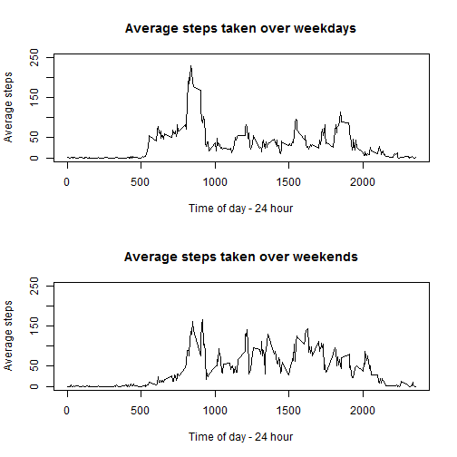

# Reproducible Research - Peer Assessment 1
========================================================
## Personal Activity Monitoring Device
--------------------------------------------------------

## Introduction

This report makes use of data recorded by a personal activity monitoring device.
The device collects the number of steps taken in 5 minute intervals.
The period for this data set is October/November 2012.
The following report is an exploratory analysis of the data.

## Loading and preprocessing the data
Make sure that the data (activity.csv) is located within your working directory


```r
raw.activity <- read.csv("activity.csv", stringsAsFactors = FALSE)
```

--------------------------------------------------------

## Part 1  - Histogram, Mean and Median steps taken per day

First, let's omit the NA's from out calculation (we will deal with these later).
Next, sum up the total number of steps taken each day.

```r
raw.activity.na.omit <- na.omit(raw.activity)
total.steps.perday <- aggregate(raw.activity.na.omit$steps, by=list(raw.activity.na.omit$date),FUN=sum, na.omit = TRUE)
```

Here is a histogram of total steps taken each day


```r
par(mfrow=c(1,1))
hist(total.steps.perday$x
     ,xlab = "Total steps per day"
     ,main = "Histogram of total steps per day")
```

 

As you can see there is a wide distribution of steps taken each day.
With a majority sitting in between 10,000 and 15,000 steps per day.

Now let's calculate the mean and median number of steps taken each day.

```r
options(scipen = 1, digits = 2)
mean <- mean(total.steps.perday$x)
median <- median(total.steps.perday$x)
```

The mean number of steps is 10767.19.
The median number of steps is 10766.

--------------------------------------------------------

## Part 2 - Average Daily Pattern Activity

Taking a look at the average number of steps taken over each 5 minutes interval, averaged across all days.
We first aggregate the raw table (without NA) by calculating the mean steps per 5 minute interval.

```r
mean.steps.perinterval <- aggregate(raw.activity.na.omit$steps,by = list(raw.activity.na.omit$interval),FUN=mean)
```

Next we plot to see the average trend of steps taken across a day.

```r
par(mfrow=c(1,1))
plot(x = mean.steps.perinterval$Group.1
     ,y=mean.steps.perinterval$x
     , type = "l"
     ,xlab = "Time of day - 24 hour"
     ,ylab = "Average steps"
     ,main = "Average steps taken over a day")
```

 

Which 5-minute interval, on average across all the days in the dataset, contains the maximum number of steps?


```r
mean.steps.sort <- mean.steps.perinterval[order(-mean.steps.perinterval$x),]
head(mean.steps.sort)
```

```
##     Group.1   x
## 104     835 206
## 105     840 196
## 107     850 183
## 106     845 180
## 103     830 177
## 101     820 171
```

As you can see by the header excerpt, the 5-minute interval with the highest average number of steps is at 0835 hours.

--------------------------------------------------------

## Part 3 - Imputing missing values

Now we want to try investigate the full data set by manipulating the NA's.
Let's find out how many NA's we have in our dataset.


```r
summary(raw.activity)
```

```
##      steps          date              interval   
##  Min.   :  0    Length:17568       Min.   :   0  
##  1st Qu.:  0    Class :character   1st Qu.: 589  
##  Median :  0    Mode  :character   Median :1178  
##  Mean   : 37                       Mean   :1178  
##  3rd Qu.: 12                       3rd Qu.:1766  
##  Max.   :806                       Max.   :2355  
##  NA's   :2304
```
By the summary table there are 2034 NA's in our data.

### To deal with the NA's, lets replace them with the average steps taken of that 5-minute interval over all days.

First, lets join on the average steps value for the relevant interval

We will need to use the package called 'plyr' for this next step


```r
library("plyr")

mean.steps.summary <- rename(mean.steps.perinterval,c("Group.1" = "interval"))
raw.activity.meanjoin <- join(raw.activity,mean.steps.summary, by = "interval",type = "left")
```

And now we can replace the any NA's in the column "steps" with the mean value


```r
raw.activity.meanjoin$steps[is.na(raw.activity.meanjoin$steps)] <- raw.activity.meanjoin$x[is.na(raw.activity.meanjoin$steps)] 
```

Next, aggregate the new dataset by mean steps taken each day


```r
total.steps.perday.nafill <- aggregate(raw.activity.meanjoin$steps, by=list(raw.activity.meanjoin$date),FUN=sum, na.omit = TRUE)
```

Let's now take a look at our new histogram.


```r
par(mfrow=c(1,1))
hist(total.steps.perday.nafill$x
     ,xlab = "Total steps per day"
     ,main = "Histogram of total steps per day")
```

 

Also compare the new mean and median values.


```r
meanna <- mean(total.steps.perday.nafill$x)

medianna <- median(total.steps.perday.nafill$x)
```

The mean of 10767.19 remain unchanged and now matches the median value of 10767.19 which has increased from 10766.

The distribution of average steps has now narrowed, with more days shifting into the category of 10,000 to 15,000 steps.

--------------------------------------------------------

## Part 4 - Activity patterns between weekday and weekends

Now we want to see if there is a difference between steps taken on a weekday or a weekend

Let's convert our dates to the correct format and label them with the day of the week


```r
raw.activity.meanjoin$date <- as.Date(raw.activity.meanjoin$date)
raw.activity.meanjoin$day.type <- weekdays(raw.activity.meanjoin$date)
```

Next we want to create subsets of the data based whether the steps occured on a weekday or weekend.


```r
weekday <- c("Monday","Tuesday","Wednesday","Thursday","Friday")
weekend <- c("Saturday","Sunday")

activity.weekday <- subset(raw.activity.meanjoin, raw.activity.meanjoin$day.type %in% weekday)
activity.weekend <- subset(raw.activity.meanjoin, raw.activity.meanjoin$day.type %in% weekend)
```

Now to aggregate them separately as average steps per interval, across days included.


```r
mean.activity.weekday <- aggregate(activity.weekday$steps,by = list(activity.weekday$interval),FUN=mean)
mean.activity.weekend <- aggregate(activity.weekend$steps,by = list(activity.weekend$interval),FUN=mean)
```

Finally, we can plot these two graphs on top of each other for a like comparison.


```r
par(mfrow=c(2,1))

plot(x = mean.activity.weekday$Group.1
     ,y=mean.activity.weekday$x
     , type = "l"
     ,xlab = "Time of day - 24 hour"
     ,ylim=c(0, 250)
     ,ylab = "Average steps"
     ,main = "Average steps taken over weekdays")

plot(x = mean.activity.weekend$Group.1
     ,y=mean.activity.weekend$x
     , type = "l"
     ,xlab = "Time of day - 24 hour"
     ,ylim=c(0, 250)
     ,ylab = "Average steps"
     ,main = "Average steps taken over weekends")
```

 

Looking at the above graphs it is apparant that there is more activity in the afternoons of a weekend. Whereas most of the activity on a weekday occurs at 0835, which may be indicative of daily travel to a weekly routine (example: job or class).

--------------------------------------------------------
